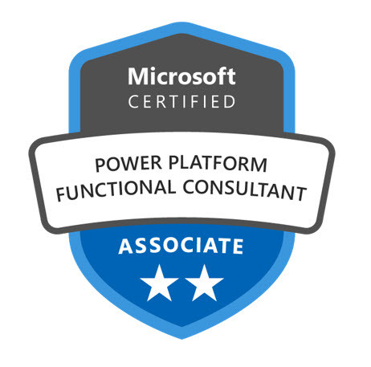

# PL-200 

Overview
--------
The goal of *PL-200* is for a functional consultant, data analyst or a developer to hone their configuration skills with no code or low code. This captures all hand written notes all about Microsoft Power Platform solutions. Using these notes you can build model driven apps and understand Power Automate flows. 

Dynamics CRM
------------

Microsoft Dynamics CRM is a customer relationship management software package developed by Microsoft
focused on enhancing the customer relationship for any organization.
Out of the box, the product focuses mainly on Sales, Marketing, and Customer Service sectors.
	
Dynamics 365 Apps and Power Apps - uses CDS (Common data service) which is also known as Dataverse.

Dynamics 365
------------
It comes with pre-built modules (by Microsoft) or apps for sales, marketing, service - built on CDS.
Pre-build modules: 
* Business Processes
* Entities
* Workflows
* tools
Allows customization over CDS - to build functionality

Power Apps
------------				
There are No pre-built modules
Default CDS with basic entities: 
* Account
* Contact
* Email
* Task
PowerApps is a tool that allows you to create custom apps, leveraging many of the features of the Office 365 and Microsoft platform. Apps can be accessed via mobile devices or via the browser.

Trial Account
------------
Trial Account can be created to build apps using - https://admin.powerplatform.com

Customer Relationship Mangement
------------
Customer Relationship Management - Goal : Customer Satisfaction
Deals with Customer, customer data
Used by sales, customer service and marketing.

CRM Modules - Sales, customer service, Field service, Marketing
